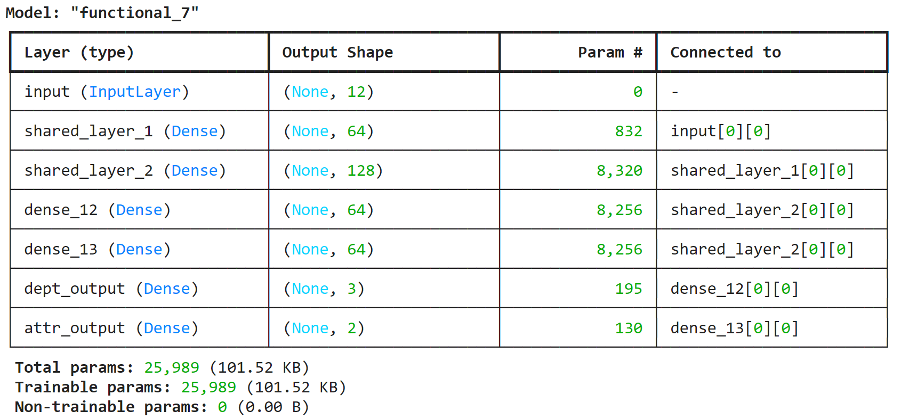

# Creating a layered neural network for HR to predict employee attrition

The project will cover following topics

1. [Import required libraries and data](#import-required-libraries)
2. [Define end goal](#define-end-goal)
3. [Understand the data](#understand-the-data)
4. [Split the Data into Training and Testing Sets](#split-the-data-into-training-and-testing-sets)
5. [Encoding and scaling X data](#encoding-and-scaling-x-data)
6. [Encoding Department and Attrition columns (y data)](#encoding-department-and-attrition-columns)
7. [Defining model componentsl](#defining-model-components)
8. [Create and compile the mode](#create-and-compile-the-model)
9. [Model training](#model-training-and-evaluation)
10. [Evaluation results](#evaluation-results)
11. [Answering questions](#answering-the-questions)

### Import required libraries
```python 
# Import our dependencies
from sklearn.model_selection import train_test_split
from sklearn.preprocessing import StandardScaler
import pandas as pd
import numpy as np
from tensorflow.keras.models import Model
from tensorflow.keras import layers
from sklearn.preprocessing import OneHotEncoder

```
The code imports an existing scaled dataset to use for this project

```python
# Import the data
attrition_df = pd.read_csv('https://static.bc-edx.com/ai/ail-v-1-0/m19/lms/datasets/attrition.csv')
attrition_df.head() # to view top 5 records of 
```

### Define end goal
The project is intended for creating a neural network that HR can use to predict whether employees are likely to leave the company. Additionally, HR believes that some employees may be better suited to other departments, so you are also asked to predict the department that best fits each employee. These two columns should be predicted using a branched neural network.

### Understand the data
We will attempt to understand count of unique values within individual columns by using nunique() and understand data types by using dtypes

```python
# Determine the number of unique values in each column.
attrition_df.nunique()

# Determine data types column.
attrition_df.dtypes

```

Considering that we have been tasked having Attrition and Department as target variables, we will understand how well is the data distributed among the values by printing value_counts for both columns

```python
# Create y_df with the Attrition and Department columns
y_df = attrition_df[['Attrition', 'Department']]
print(y_df['Attrition'].value_counts())
print(y_df['Department'].value_counts())
```
We will not create a dataframe to use as X with atleast 10 columns. Here I decided to use 11 columns which included JobRole and BusinessTravel as categorical columns
```python
X_data = ['Education','Age','DistanceFromHome','JobSatisfaction','StockOptionLevel','WorkLifeBalance','YearsAtCompany', 
          'YearsSinceLastPromotion','NumCompaniesWorked', 'JobRole','BusinessTravel']


# Create X_df using your selected columns
X_df = attrition_df[X_data]

# Show the data types for X_df
X_df.dtypes
```

### Split the Data into Training and Testing Sets
We will not split our X and y data which are referenced by X_df and y_df

```python
X_train, X_test, y_train, y_test = train_test_split(X_df, y_df, random_state=10)
```
### Encoding and scaling X data
Since we hvae 2 columns with categorical data, we will need to encode them. We will use OneHotEncoder to do the encoding. This will convert categorical values to numbers to they can be used in training the model

```python
# Convert your X data to numeric data types however you see fit
# Add new code cells as necessary
ohc = OneHotEncoder(sparse_output=False)
ohc.fit(X_train[['JobRole', 'BusinessTravel']])
X_train_encoded = ohc.transform(X_train[['JobRole', 'BusinessTravel']])
X_test_encoded = ohc.transform(X_test[['JobRole', 'BusinessTravel']])
```

We will not instantiate an instance of StandardScaler and use to fit and transform X data.
```python
# Create a StandardScaler
scaler = StandardScaler()

# Fit the StandardScaler to the training data
X_scaler = scaler.fit(X_train_encoded)

# Scale the training and testing data
X_train_scaled = X_scaler.transform(X_train_encoded)
X_test_scaled = X_scaler.transform(X_test_encoded)
```

### Encoding Department and Attrition columns
We will again use new instance of OneHotEncoder for each of the two y columns. We will have reshape the data using np.array to correctly feed it for the model

```pythin
# Create a OneHotEncoder for the Department column
from sklearn.preprocessing import OneHotEncoder
department_encoder = OneHotEncoder(drop=None, handle_unknown='ignore',sparse_output=False)

# Fit the encoder to the training data
department_encoder.fit(np.array(y_train['Department']).reshape(-1, 1))

# Create two new variables by applying the encoder to the training and testing data
dept_y_train_encoded = department_encoder.transform(np.array(y_train['Department']).reshape(-1, 1))
dept_y_test_encoded = department_encoder.transform(np.array(y_test['Department']).reshape(-1, 1))
dept_y_test_encoded

# Create a OneHotEncoder for the Attrition column
attrition_encoder = OneHotEncoder(drop=None, handle_unknown='ignore',sparse_output=False)

# Fit the encoder to the training data
attrition_encoder.fit(np.array(y_train['Attrition']).reshape(-1, 1))

# Create two new variables by applying the encoder
# to the training and testing data
attr_y_train_encoded = attrition_encoder.transform(np.array(y_train['Attrition']).reshape(-1, 1))
attr_y_test_encoded = attrition_encoder.transform(np.array(y_test['Attrition']).reshape(-1, 1))

```
This completes our data pre processing tasks. Now we will proceed towards creating, compiling and training the model


### Defining model components

We will define layers and branching needed in the model for two target columns 

```python
# Find the number of columns in the X training data
cols = X_train_scaled.shape[1]

# Create the input layer
input = layers.Input(shape=(cols, ), name='input')


# Create at least two shared layers
shared1 = layers.Dense(64, activation="relu",name='shared_layer_1')(input)
shared2 = layers.Dense(128, activation="relu",name='shared_layer_2')(shared1)

# Create a branch for Department
# with a hidden layer and an output layer

# Create the hidden layer
department_input = layers.Dense(64, activation='relu')(shared2)

# Create the output layer
department_output = layers.Dense(3, activation='softmax', name = "dept_output")(department_input)

# Create a branch for Attrition
# with a hidden layer and an output layer

# Create the hidden layer
attrition_input = layers.Dense(64, activation='relu')(shared2)

# Create the output layer
attrition_output = layers.Dense(2, activation='sigmoid', name = "attr_output")(attrition_input)

```

### Create and compile the model
We will now proceed to create model with input and output layers.

```python
# Create the model
model = Model(inputs=input, outputs=[ department_output, attrition_output])

# Compile the model
model.compile(optimizer='adam', loss={
        'dept_output': 'categorical_crossentropy',
              'attr_output': 'binary_crossentropy'},
              metrics=[['accuracy'], ['accuracy']])

# Summarize the model
model.summary()
```


### Model training
First, we will train the model using scaled and encoded data using 100 epochs and baschsize of 16

```python
# Train the model with the training data
model.fit(X_train_scaled, {"dept_output": dept_y_train_encoded, "attr_output" : attr_y_train_encoded}, epochs=100, batch_size=16)

# Evaluate the model with the testing data
model_loss1, model_accuracy1, model_accuracy2 = model.evaluate(X_test_scaled,[dept_y_test_encoded, attr_y_test_encoded],verbose=0)

# Display evaluation results
print(f"Loss: {round(model_loss1,4)} \nAttrition Accuracy: {round(model_accuracy1,4)} \nDepartment Accuracy: {round(model_accuracy2,4)} ")
```
### Evaluation results
Loss: 0.4866
Attrition Accuracy: 0.8315
Department Accuracy: 0.9783

### Answering the questions

1. Is accuracy the best metric to use on this data? Why or why not?
    Accuracy may not be the best metric on his data because the classes viz. Attrition and Department are not evenly distributed. Having said that, there appears to be correlation between Department and JobRole data as I noticed a different accuracy ration when JobRole was not addedto dataset
2. What activation functions did you choose for your output layers, and why?
    There may be possibilities to do more feature engineering as well as handle class imbalance especially for Attrition data
3. Can you name a few ways that this model might be improved?
    The model can be improved by creating deeper and wider neural networks. Initially I started with just OverTime as categorical data which was giving much higher loss and lot lesser Department accuracy. By excluding OverTime, the Loss Ration improved substantially in addition to much better department accuracy. The attrition accuracy may have gone down marginally. There may be possibilities to do more feature engineering as well as handle class imbalance especially for Attrition data.